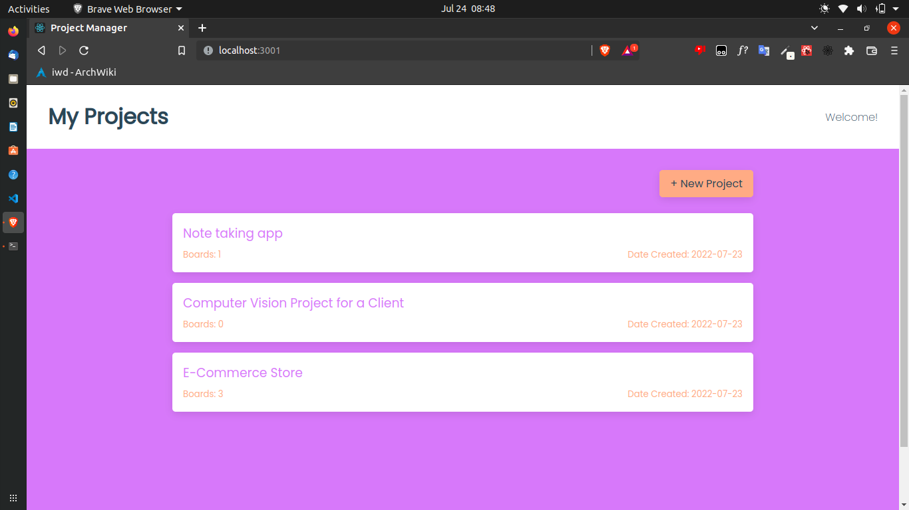
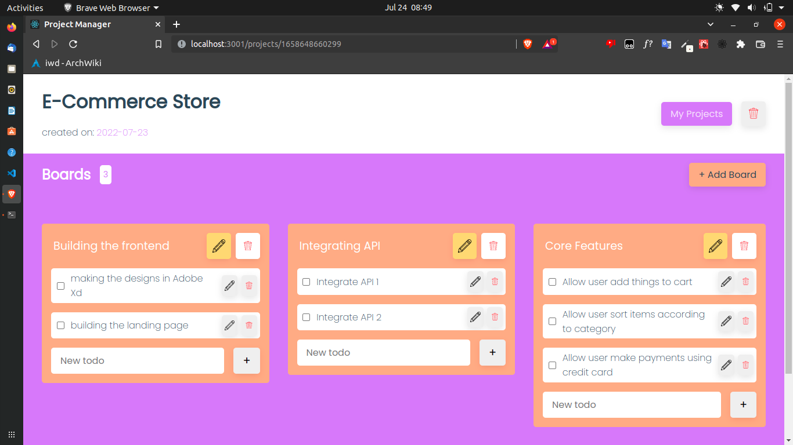
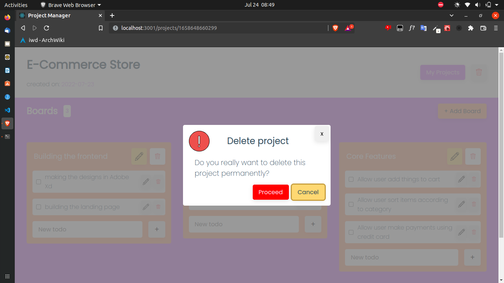

# Project Manager App

## Project Description
Project Manager App is an offline webapp that you can use to manager your notes and todos for your projects. Group various todos as **boards** and manage todos as **cards**

### <span style="text-decoration:underline"> Index Page </span>
This is where all your projects or notes are displayed and you can add new project



### <span style="text-decoration:underline"> Project details page </span>
This page allows you see and edit the details of a project todo. A Board can represent a group of todos.





## Run this project on your machine
- Clone the project
`git clone https://github.com/MikeyOnyedika/project-manager-app-react.git`
- Install XAMPP if you don't already have mysql setup locally [download xampp here](https://xampp.org). Make sure to check the mysql server option when installing XAMPP
- Open the XAMPP control panel and fire up the mysql server
- open `localhost/phpmyadmin` on your browser
- Create a database and setup a user account for that database to match the specification in backend/.env like as below. 
```env
DB_NAME=project-manager-app
DB_USER=root
DB_USER_PASSWORD=admin333
```
**Note:** You can also decide to change the database credentials in this backend/.env but make sure they are the same credentials used to create the database in XAMPP
- Open a terminal/Command prompt in root of the project and run `npm start`, then wait for the project to be set up. This may take some time so you may want to go grab a coffee or watch one or two youtube videos or check your messages on facebook/discord/telegram etc. The point is, you have been warned.
- To contribute to this project, open a pull request and I will be sure to check it out. Also, if you find bugs or think of any improvements to the project, kindly open an Issue. 

Happy Coding!!! 🎉
